 

---

## 🧑‍💻 About Me

<table>
<tr>
<td valign="top" width="55%">

 

- 🎓 &nbsp; **B.Tech EEE @ VIT Vellore** — Batch 2026
- 🏅 &nbsp; CGPA **8.74** &nbsp;|&nbsp; **Global Rank #13** Spark-Wars 4.0
- ⚙️ &nbsp; I build **backend systems & AI-powered products**
- 🤖 &nbsp; Working with **LangGraph · Claude API · PPO/DRL · LSTM**
- 🏗️ &nbsp; 3× Hackathon builder — ET GenAI · NatWest · CodeCure
- 📚 &nbsp; Grinding **System Design & DSA** for SDE roles
- 💼 &nbsp; **Open to SDE / Backend Engineering** roles in India
- ⚡ &nbsp; I've rewritten the same backend 3 times just to get it right

 

</td>
<td valign="top" width="45%" align="center">

</td>
</tr>
</table>

---

## 🛠️ Tech Stack

**Languages**

**Backend & APIs**

**Frontend**

**Databases & DevOps**

**AI / ML**

**Tools**

---

## 📊 GitHub Stats

&nbsp;&nbsp;

---

## 📈 Activity Graph

---

## 🐍 Snake Eating My Contributions

<picture>
  <source media="(prefers-color-scheme: dark)" srcset="https://raw.githubusercontent.com/dbansal0607/dbansal0607/output/github-contribution-grid-snake-dark.svg"/>
  <source media="(prefers-color-scheme: light)" srcset="https://raw.githubusercontent.com/dbansal0607/dbansal0607/output/github-contribution-grid-snake.svg"/>
  
</picture>

---

